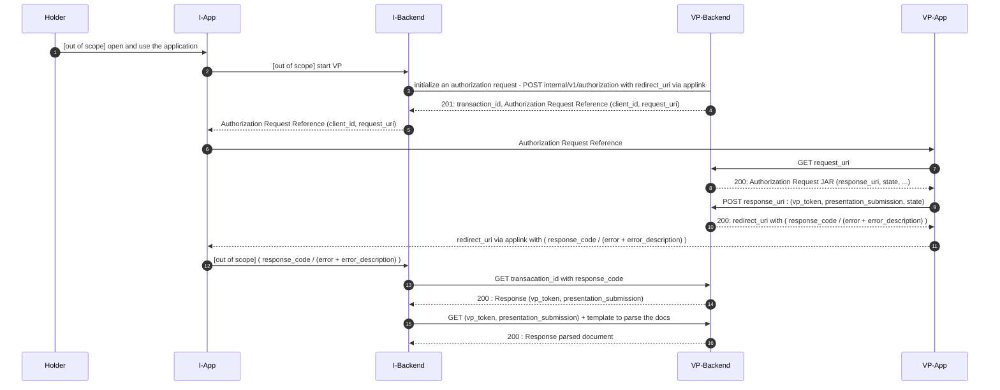

# Pack VP Integration

## Standards

| Standard   | Utility                                                                          |
|------------|----------------------------------------------------------------------------------|
| OpenID4VP  | RPx will implement OpenID4VP to fetch identity data                             |
| ISO18013-5 | Identity data exchanged between Wallet and RPx will be under the ISO18013-5 format |
| RFC9101    | The OAuth 2.0 Authorization Framework: JWT-Secured Authorization Request (JAR)   |

## Architecture

We specify here the architecture of the RPx/Wallet project

### Participants

* Holder : A citizen having its eID card activated in such way he has a level of assurance Substantial or High
* I-Backend : The Integrator backend
* I-App : The Integrator mobile application
* VP-Backend : The VP backend (the Wallet backend for example)
* VP-App : The VP mobile application (the Wallet mobile app for example)

### Protocol



#### 1. The holder opens/ uses the application

#### 2. I-App or the I-Backend start the VP protoccol

#### 3. I-Backend initializes an authorization request to VP-Backend

```http
POST https://openid4vp.server.example.com/internal/v1/authorization HTTP/1.1
Content-Type: application/json
{
  "scope": "RPx",
  "redirect_uri": "https://enrol.rpx.fr/appFI#data=eyJXXXXXXXXXXXXX",
  "mode": "direct_post",
  "wallet_uri": "https://wallet.fr",
  "ttl": 900,
  "trusted_certificate": {
    "fr.wallet.1": [
      "-----BEGIN CERTIFICATE-----\nMIICWgAw...",
      "-----BEGIN CERTIFICATE-----\nMIICWgAw..."
    ]
  }
}

```

* scope : The scope can be personalized (it MUST be known and configured by Wallet). This element identifies the Mdoc and data to get
* redirect_uri : The redirect_uri is the AppLink that opens the I-App once the VP protocol is completed.
* ttl : session time to live
* trusted_certificates : This element is a map that associate the docType of document (Mdoc) to the trusted certificates (in PEM format) enabling to verify the received Mdoc document.
* wallet_uri : The wallet_uri is applink to open the application VP-App
* mode : the mode used by VP. `direct post`is only supported for the moment.

#### 4. VP backend responds with the authorization request reference

```http
HTTP/1.1 201 CREATED
Location: https://openid4vp.server.example.com/v1/authorization/data?transaction_id=50N7b7derbdEP6yfldpQ7A

Content-Type: text/plain

https://wallet.fr?client_id=idakto_demo&request_uri=https%3A%2F%2Fopenid4vp.server.example.com%2Fv1%2Fauthorization%2Frequest.jwt%2FmIr49NwoozQb-Hwmxp6vCg

```

* The Location header contains the URL indicating where the client can retrieve the ressource after VP completion.
* The body contains the authorization request reference with the request_uri and client_id

#### 5. I-Backend sends the authorization request reference to I-App [out-of-scope]

#### 6. I-App send Authorization request reference to VP-App via appLink [out-of-scope]

#### 7. Protocol VP between VP-App and VP-Backend : Retrieve an authorization request [out-of-scope]

#### 8. Protocol VP between VP-App and VP-Backend [out-of-scope]

#### 9.  Protocol VP between VP-App and VP-Backend [out-of-scope]

#### 10.  Protocol VP between VP-App and VP-Backend [out-of-scope]

#### 11.  VP-App sends redirect URI  (with code_activation or error ) to I-App via appLink

* In case of success: The VP-App returns the response code identifying the previously generated VP-Token.

```http
HTTP/1.1 200 OK
Content-Type: application/json

{
  "redirect_uri": "https://enrol.rpx.fr/appFI#data=eyJXXXXXXXXXXXXX?response_code=Lo6NgF0xsskZb8Yz6iyBtR9ahBId3Gk6JCTFBLgfp10"
}
```

* In case of error :

```http
HTTP/1.1 200 OK
Content-Type: application/json

{
  "redirect_uri": "https://enrol.rpx.fr/appFI#data=eyJXXXXXXXXXXXXX?error=invalid_request&error_description..."
}

```

#### 12.  I-App sends  the response_code or the error to I-Backend [out-of-scope]

#### 13.  In the case success, I-Backend get the data from  VP-Backend

```http
GET /v1/authorization/data HTTP/1.1
Content-Type: application/json
{
    "transaction_id": "50N7b7derbdEP6yfldpQ7A",
    "response_code": "Lo6NgF0xsskZb8Yz6iyBtR9ahBId3Gk6JCTFBLgfp10"
}

```

#### 14. VP-Backend returns the token

```http
HTTP/1.1 200 OK
Content-Type: application/json
{
  "authorization_response": {
    "presentation_submission": {
      "deWalletition_id": "RPx",
      "descriptor_map": [
        {
          "format": "mso_mdoc",
          "id": "fr.wallet.1",
          "path": "$"
        }
      ],
      "id": "24e5360d-44e5-4abd-8835-201fb68eb3fd"
    },
    "vp_token": "pGd2ZXJzaW....",
  }
}
```

#### 15. I-Backend requests to parse the VP-Token received from the the VP-Backend

The VP-Backend provides an endpoint dedicated to retrieve a parsed Verifiable Presentation (VP) Token using a specific template. The VP Token must be passed in the request header, and the template must be included in the URL path.

```http
GET /internal/v1/parsevptoken?template={template} HTTP/1.1
Content-Type: application/json
vptoken: pGd2ZXJzaW....
```

Note: Vp-Token is a Header in not order to set some sensitive data in the URL.

An example template could be :

```JSON
{
 "exampleDocument": {
  "exampleNamespace": {
   "birth_city": {
    "presence": "M",
    "format": "tstr",
    "output_identifier": "birth_city"
   },
   "birth_country": {
    "presence": "M",
    "format": "tstr",
    "output_identifier": "birth_country"
   },
   "family_name": {
    "presence": "M",
    "format": "tstr",
    "output_identifier": "family_name"
   },
   "given_name": {
    "presence": "M",
    "format": "tstr",
    "output_identifier": "given_name"
   },
   "birth_date": {
    "presence": "M",
    "format": "tstr",
    "output_identifier": "birth_date"
   },
   "birth_state": {
    "presence": "M",
    "format": "tstr",
    "output_identifier": "birth_state"
   },
   "birth_country_cog": {
    "presence": "M",
    "format": "tstr",
    "output_identifier": "birth_country_cog"
   },
   "birth_country_label": {
    "presence": "M",
    "format": "tstr",
    "output_identifier": "birth_country_label"
   },
   "birth_place_cog": {
    "presence": "O",
    "format": "tstr",
    "output_identifier": "birth_place_cog"
   },
   "birth_place_label": {
    "presence": "M",
    "format": "tstr",
    "output_identifier": "birth_place_label"
   },
   "gender": {
    "presence": "M",
    "format": "uint",
    "output_identifier": "gender"
   },
   "email": {
    "presence": "M",
    "format": "tstr",
    "output_identifier": "email"
   },
   "portrait": {
    "presence": "M",
    "format": "bstr",
    "output_identifier": "portrait"
   },
   "preferred_username": {
    "presence": "O",
    "format": "tstr",
    "output_identifier": "preferred_username"
   }
  }
 }
}
```

The VP token has been successfully parsed based on the provided template, a JSON containing the parsed claims is returned.

```http
HTTP/1.1 200 OK
Content-Type: application/json
{
 "birth_city": "Paris",
 "birth_country": "FR",
 "birth_date": "1990-07-13",
 "birth_state": "Ile-de-France",
 "email": "maelys.martin@email.com",
 "family_name": "Martin",
 "family_name_birth": "Martin",
 "gender": 2,
 "given_name": "Maelys",
 "portrait": "/9j/4AAQSkZJRgABAQAAAQABAAD/"
}
```
